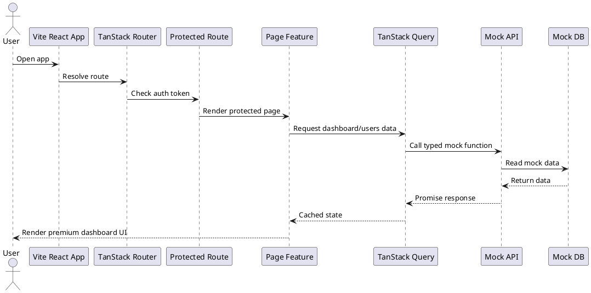

# SPEC-2-Vite Premium Admin Dashboard Template

## Background

Produk yang akan dibuat adalah **admin dashboard template berbasis Vite + React** yang sederhana, premium, profesional, dan eye catching. Template ini ditujukan untuk dijual sebagai produk digital atau digunakan sebagai starter project oleh developer, agency kecil, dan startup.

Fokus MVP adalah menghasilkan dashboard yang terlihat matang secara visual, mudah dimodifikasi, dan cukup lengkap untuk dijadikan fondasi aplikasi admin sederhana. Scope sengaja dibuat **Vite-only** agar implementasi cepat, ringan, mudah dipahami AI coding agent, dan tidak terlalu kompleks.

Template harus terasa seperti aplikasi nyata, bukan hanya kumpulan komponen kosong. Karena itu, dashboard perlu memiliki mock data, halaman utama, tabel pengguna, halaman analytics sederhana, settings, dan layout admin yang rapi.

Target kualitas visual:

- Premium SaaS admin look.
- Clean, modern, responsive.
- Mendukung light mode dan dark mode.
- Memiliki sidebar elegan, topbar, cards, chart, table, dan empty/loading states.
- Tidak terlihat seperti default shadcn/ui mentah.

## Requirements

### Must Have

- Menggunakan **Vite + React + TypeScript**.
- Menggunakan **Tailwind CSS v4** untuk styling.
- Menggunakan komponen berbasis **shadcn/ui + Radix UI**.
- Menggunakan **Lucide React** untuk icon.
- Menggunakan **TanStack Router** untuk routing client-side.
- Menggunakan **TanStack Query** untuk simulasi data fetching dari mock API.
- Menggunakan **Zustand** untuk UI state sederhana seperti sidebar collapsed dan theme mode.
- Menggunakan **React Hook Form + Zod** untuk form validation.
- Menggunakan **Recharts** untuk chart dashboard.
- Memiliki layout admin responsive:
  - Sidebar desktop.
  - Collapsible sidebar.
  - Mobile sidebar drawer.
  - Topbar dengan search, notification, theme switcher, dan user menu.
- Memiliki halaman MVP:
  - Login page.
  - Dashboard overview.
  - Analytics page.
  - Users list page.
  - User detail drawer/modal.
  - Settings page.
  - 404 page.
- Memiliki mock API internal berbasis TypeScript functions, bukan backend asli.
- Memiliki mock data realistis untuk users, revenue, activity, traffic, dan notifications.
- Memiliki reusable components:
  - Stat card.
  - Chart card.
  - Data table.
  - Status badge.
  - Page header.
  - Empty state.
  - Loading skeleton.
  - Confirm dialog.
- Memiliki dokumentasi singkat di `README.md`.
- Build harus sukses dengan `pnpm build`.
- Type check harus sukses dengan `pnpm typecheck`.

### Should Have

- Theme preset minimal:
  - Default Corporate.
  - Premium Dark.
- Data table memiliki search, filter status, pagination sederhana, dan row action menu.
- Login flow mock menggunakan fake token di localStorage.
- Protected route untuk halaman dashboard.
- Sidebar menu aktif sesuai route.
- Global command/search palette sederhana.
- Toast notification untuk aksi seperti login, logout, update settings, dan delete user.

### Could Have

- Export CSV untuk users table.
- Notification popover dengan daftar notifikasi.
- Activity timeline di dashboard.
- User invite form.
- Billing/pricing sample page.
- Simple onboarding checklist card.

### Won't Have untuk MVP

- Next.js version.
- Backend production.
- Database asli.
- Authentication production.
- Role-based access control kompleks.
- Multi-tenant organization management.
- Real payment integration.
- Visual page builder.

## Method

### Technical Architecture Summary

Bangun aplikasi sebagai **single Vite SPA** dengan pemisahan folder berdasarkan domain/feature. Semua data berasal dari mock API internal agar AI agent dapat langsung membangun UI tanpa menunggu backend.

Arsitektur harus menjaga tiga prinsip:

1. **Simple to build**: tidak ada monorepo, tidak ada backend, tidak ada SSR.
2. **Premium to sell**: visual polish, animasi halus, spacing rapi, dark mode bagus.
3. **Easy to customize**: theme token, komponen reusable, route config, mock API terpisah.

### Recommended Dependencies

```json
{
  "dependencies": {
    "@hookform/resolvers": "latest",
    "@radix-ui/react-avatar": "latest",
    "@radix-ui/react-dialog": "latest",
    "@radix-ui/react-dropdown-menu": "latest",
    "@radix-ui/react-label": "latest",
    "@radix-ui/react-popover": "latest",
    "@radix-ui/react-select": "latest",
    "@radix-ui/react-separator": "latest",
    "@radix-ui/react-slot": "latest",
    "@radix-ui/react-tabs": "latest",
    "@tanstack/react-query": "latest",
    "@tanstack/react-router": "latest",
    "class-variance-authority": "latest",
    "clsx": "latest",
    "cmdk": "latest",
    "lucide-react": "latest",
    "next-themes": "latest",
    "react": "latest",
    "react-dom": "latest",
    "react-hook-form": "latest",
    "recharts": "latest",
    "sonner": "latest",
    "tailwind-merge": "latest",
    "zod": "latest",
    "zustand": "latest"
  },
  "devDependencies": {
    "@tailwindcss/vite": "latest",
    "@types/react": "latest",
    "@types/react-dom": "latest",
    "@vitejs/plugin-react": "latest",
    "eslint": "latest",
    "prettier": "latest",
    "tailwindcss": "latest",
    "typescript": "latest",
    "vite": "latest",
    "vitest": "latest"
  }
}
```

Note untuk AI agent:

- Gunakan versi package stabil terbaru saat implementasi.
- Jangan menambahkan Next.js.
- Jangan membuat backend.
- Jangan membuat monorepo.
- Jangan membuat UI terlalu ramai.

### Folder Structure

```txt
premium-admin-vite/
  public/
    logo.svg
    mock-avatars/

  src/
    app/
      app.tsx
      providers.tsx
      router.tsx

    assets/

    components/
      ui/
        button.tsx
        card.tsx
        input.tsx
        badge.tsx
        dialog.tsx
        dropdown-menu.tsx
        select.tsx
        tabs.tsx
        avatar.tsx
        skeleton.tsx
        separator.tsx
      layout/
        app-layout.tsx
        sidebar.tsx
        mobile-sidebar.tsx
        topbar.tsx
        nav-item.tsx
        user-menu.tsx
        theme-toggle.tsx
      shared/
        page-header.tsx
        stat-card.tsx
        chart-card.tsx
        empty-state.tsx
        loading-card.tsx
        confirm-dialog.tsx
        command-menu.tsx
        status-badge.tsx

    features/
      auth/
        auth.api.ts
        auth.store.ts
        auth.types.ts
        login-page.tsx
        protected-route.tsx
      dashboard/
        dashboard.api.ts
        dashboard.types.ts
        dashboard-page.tsx
        components/
          revenue-chart.tsx
          traffic-chart.tsx
          activity-feed.tsx
          kpi-grid.tsx
      analytics/
        analytics-page.tsx
        components/
          acquisition-chart.tsx
          conversion-card.tsx
      users/
        users.api.ts
        users.types.ts
        users-page.tsx
        components/
          users-table.tsx
          user-detail-drawer.tsx
          user-filter-bar.tsx
          user-form.tsx
      settings/
        settings-page.tsx
        settings.schema.ts

    lib/
      mock-api/
        delay.ts
        mock-db.ts
        mock-dashboard.ts
        mock-users.ts
      constants.ts
      format.ts
      cn.ts
      storage.ts

    routes/
      index.tsx
      login.tsx
      dashboard.tsx
      analytics.tsx
      users.tsx
      settings.tsx
      not-found.tsx

    store/
      ui-store.ts

    styles/
      globals.css
      theme.css

    main.tsx

  index.html
  package.json
  tsconfig.json
  vite.config.ts
  README.md
```

### App Flow



### Visual Direction

Gunakan gaya visual berikut:

- Background utama: soft gradient atau layered neutral background.
- Cards: rounded-2xl, subtle shadow, soft border, cukup whitespace.
- Sidebar: dark glass/neutral premium look pada desktop; mobile drawer pada layar kecil.
- Topbar: sticky, translucent, border-bottom halus.
- KPI cards: icon badge, percentage trend, mini sparkline optional.
- Charts: minimal, tidak terlalu banyak warna, fokus ke clarity.
- Tables: bersih, row hover, status badge, action dropdown.
- Dark mode: bukan pure black; gunakan slate/zinc tone agar terlihat premium.
- Animasi: gunakan transition Tailwind sederhana; hindari animasi berlebihan.

Suggested theme tokens di `src/styles/theme.css`:

```css
:root {
  --radius-card: 1rem;
  --radius-control: 0.75rem;
  --shadow-card: 0 18px 45px rgb(15 23 42 / 0.08);
  --shadow-soft: 0 10px 30px rgb(15 23 42 / 0.06);
}

.dark {
  --shadow-card: 0 18px 45px rgb(0 0 0 / 0.28);
  --shadow-soft: 0 10px 30px rgb(0 0 0 / 0.22);
}
```

### Route Map

```txt
/login              Public login page
/                   Redirect to /dashboard when authenticated
/dashboard          Dashboard overview
/analytics          Analytics page
/users              Users list and user detail drawer
/settings           Settings form
*                   404 page
```

### Navigation Items

```ts
const navItems = [
  { label: "Dashboard", href: "/dashboard", icon: LayoutDashboard },
  { label: "Analytics", href: "/analytics", icon: ChartNoAxesCombined },
  { label: "Users", href: "/users", icon: Users },
  { label: "Settings", href: "/settings", icon: Settings }
];
```

### Mock Data Model

```ts
export type UserStatus = "active" | "invited" | "suspended";

export type User = {
  id: string;
  name: string;
  email: string;
  avatarUrl?: string;
  role: "Admin" | "Manager" | "Designer" | "Developer" | "Support";
  status: UserStatus;
  location: string;
  lastActiveAt: string;
  createdAt: string;
};

export type DashboardKpi = {
  label: string;
  value: string;
  change: number;
  trend: "up" | "down";
};

export type RevenuePoint = {
  month: string;
  revenue: number;
  expenses: number;
};

export type ActivityItem = {
  id: string;
  actor: string;
  action: string;
  target: string;
  createdAt: string;
};
```

### Mock API Contract

Implementasikan mock API sebagai typed async functions dengan artificial delay.

```ts
export const authApi = {
  login: async (payload: { email: string; password: string }) => {
    await delay(600);
    if (payload.email !== "admin@example.com" || payload.password !== "password") {
      throw new Error("Invalid email or password");
    }
    return {
      token: "mock-token",
      user: {
        id: "usr_1",
        name: "Alex Morgan",
        email: "admin@example.com",
        role: "Admin"
      }
    };
  }
};
```

```ts
export const usersApi = {
  list: async (params: { search?: string; status?: UserStatus | "all"; page?: number }) => {
    await delay(500);
    return {
      data: filteredUsers,
      meta: {
        page: params.page ?? 1,
        pageSize: 10,
        total: filteredUsers.length
      }
    };
  },
  getById: async (id: string) => {
    await delay(300);
    return users.find((user) => user.id === id);
  }
};
```

### Authentication Strategy

MVP menggunakan fake authentication.

Rules:

- Login berhasil hanya dengan:
  - Email: `admin@example.com`
  - Password: `password`
- Simpan token di localStorage.
- Protected route mengecek token.
- Logout menghapus token dan redirect ke `/login`.
- Tidak perlu refresh token.
- Tidak perlu real security.

### Dashboard Page Composition

Dashboard harus memiliki:

1. Page header dengan title, subtitle, dan date range button.
2. KPI grid berisi 4 cards:
   - Total Revenue.
   - Active Users.
   - Conversion Rate.
   - Open Tickets.
3. Revenue chart card.
4. Traffic source chart card.
5. Recent activity feed.
6. Premium callout card, misalnya “Upgrade workspace analytics”.

Layout desktop:

```txt
[Header]
[KPI] [KPI] [KPI] [KPI]
[Revenue Chart       ] [Traffic Chart]
[Recent Activity     ] [Premium Callout]
```

Layout mobile:

```txt
[Header]
[KPI]
[KPI]
[KPI]
[KPI]
[Revenue Chart]
[Traffic Chart]
[Recent Activity]
[Premium Callout]
```

### Users Page Composition

Users page harus memiliki:

- Page header.
- Search input.
- Status filter select.
- Add user button.
- Data table.
- User avatar, name, email.
- Role badge.
- Status badge.
- Last active date.
- Row actions dropdown.
- Detail drawer/modal ketika user diklik.

Tidak perlu create/edit user production. Add user button boleh membuka dialog mock.

### Settings Page Composition

Settings page harus memiliki:

- Profile settings form.
- Appearance section.
- Notification preferences.
- Save button.
- Toast setelah save.

Gunakan React Hook Form + Zod untuk profile settings.

### State Management

Gunakan Zustand hanya untuk UI state global:

```ts
type UiState = {
  sidebarCollapsed: boolean;
  commandMenuOpen: boolean;
  toggleSidebar: () => void;
  setCommandMenuOpen: (open: boolean) => void;
};
```

Jangan gunakan Zustand untuk semua server data. Data dari mock API tetap lewat TanStack Query.

### Component Rules for AI Agent

AI agent harus mengikuti aturan berikut:

- Semua komponen harus TypeScript.
- Hindari file terlalu besar; maksimal sekitar 250 baris per file jika memungkinkan.
- Buat reusable components sebelum membuat page yang kompleks.
- Gunakan `cn()` helper untuk merge className.
- Gunakan semantic HTML dan accessibility dasar.
- Semua tombol interaktif harus punya state hover/focus.
- Jangan hardcode semua data langsung di JSX page; taruh di mock data atau API file.
- Jangan menambahkan dependency besar tanpa kebutuhan jelas.
- Jangan menggunakan warna random terlalu banyak.
- Jangan menggunakan inline style kecuali sangat perlu.

### Premium UI Checklist

Setiap halaman harus memenuhi checklist visual berikut:

- Ada whitespace cukup.
- Heading hierarchy jelas.
- Card radius konsisten.
- Shadow halus, tidak berlebihan.
- Border warna subtle.
- Empty/loading state tersedia.
- Dark mode terlihat dirancang, bukan otomatis seadanya.
- Table nyaman dibaca.
- Chart tidak terlalu ramai.
- Mobile layout tidak rusak.

## Implementation

### Step 1 — Project Setup

- Buat project Vite React TypeScript.
- Install Tailwind CSS v4 dengan Vite plugin.
- Setup path alias `@/*` ke `src/*`.
- Setup shadcn/ui.
- Setup ESLint, Prettier, TypeScript strict mode.
- Buat `cn()` helper.
- Buat global styles dan theme tokens.

### Step 2 — Base UI Components

Buat atau generate komponen dasar:

- Button
- Card
- Input
- Label
- Badge
- Dialog
- Dropdown Menu
- Select
- Tabs
- Avatar
- Skeleton
- Separator
- Toast/Sonner

Setelah itu buat shared components:

- PageHeader
- StatCard
- ChartCard
- StatusBadge
- EmptyState
- LoadingCard
- ConfirmDialog

### Step 3 — App Shell

Bangun layout utama:

- AppLayout
- Sidebar
- MobileSidebar
- Topbar
- UserMenu
- ThemeToggle
- CommandMenu

Pastikan layout responsive dan route-aware.

### Step 4 — Routing and Auth

- Setup TanStack Router.
- Buat route public `/login`.
- Buat protected dashboard routes.
- Implement fake auth store/API.
- Redirect unauthenticated user ke `/login`.
- Redirect authenticated user dari `/login` ke `/dashboard`.

### Step 5 — Mock API and Data

- Buat mock users.
- Buat mock dashboard KPI.
- Buat mock chart data.
- Buat mock activity feed.
- Buat typed async API functions.
- Tambahkan artificial delay untuk loading state.

### Step 6 — Dashboard Page

- Implement KPI grid.
- Implement revenue chart.
- Implement traffic chart.
- Implement activity feed.
- Implement premium callout card.
- Pastikan dashboard terlihat kuat untuk screenshot marketing.

### Step 7 — Analytics Page

- Buat analytics summary.
- Buat conversion card.
- Buat acquisition chart.
- Buat traffic breakdown.
- Tetap sederhana, jangan terlalu penuh.

### Step 8 — Users Page

- Implement users table.
- Implement search/filter.
- Implement pagination sederhana.
- Implement detail drawer/modal.
- Implement row action dropdown.
- Implement empty state ketika filter tidak menemukan data.

### Step 9 — Settings Page

- Implement settings form dengan React Hook Form + Zod.
- Implement appearance settings.
- Implement notification preferences.
- Implement save toast.

### Step 10 — Polish and QA

- Cek responsive mobile/tablet/desktop.
- Cek dark mode.
- Cek loading state.
- Cek empty state.
- Cek keyboard navigation dasar.
- Cek build production.
- Update README.

## Milestones

### Milestone 1 — Foundation

Deliverables:

- Vite React TypeScript app berjalan.
- Tailwind CSS v4 aktif.
- shadcn/ui siap.
- Basic layout tersedia.
- Theme light/dark tersedia.

Acceptance:

- `pnpm dev` berjalan.
- `pnpm build` berhasil.
- Tampilan awal tidak blank.

### Milestone 2 — App Shell and Auth

Deliverables:

- Login page.
- Protected route.
- Sidebar/topbar.
- Logout flow.

Acceptance:

- User bisa login dengan credential mock.
- User tidak bisa akses dashboard tanpa login.
- Sidebar aktif mengikuti route.

### Milestone 3 — Dashboard MVP

Deliverables:

- Dashboard overview lengkap.
- KPI cards.
- Charts.
- Activity feed.
- Premium callout.

Acceptance:

- Dashboard layak dijadikan screenshot penjualan.
- Loading state muncul sebelum data tampil.
- Mobile layout rapi.

### Milestone 4 — Users and Settings

Deliverables:

- Users page.
- Search/filter/pagination.
- User detail drawer.
- Settings form.

Acceptance:

- Data table usable.
- Empty state tersedia.
- Save settings menampilkan toast.

### Milestone 5 — Final Polish

Deliverables:

- README.
- QA responsive.
- QA dark mode.
- Typecheck/build/lint.

Acceptance:

- `pnpm typecheck` berhasil.
- `pnpm build` berhasil.
- Tidak ada broken route utama.
- Visual konsisten di semua halaman.

## Gathering Results

Evaluasi keberhasilan template berdasarkan kriteria berikut:

### Product Quality

- Apakah dashboard terlihat premium dalam 5 detik pertama?
- Apakah screenshot dashboard layak dipakai untuk marketplace?
- Apakah light mode dan dark mode sama-sama terlihat dirancang?
- Apakah halaman tidak terasa seperti template default?

### Developer Experience

- Apakah project bisa dijalankan dari fresh clone dengan instruksi README?
- Apakah struktur folder mudah dipahami?
- Apakah data mock mudah diganti ke API asli?
- Apakah komponen reusable mudah dipakai ulang?

### Technical Quality

- Build production berhasil.
- TypeScript strict tidak error.
- Routing berjalan baik.
- Loading dan empty state ada.
- Responsive layout tidak rusak.

### MVP Completion Score

Gunakan score berikut sebelum produk dianggap siap dijual:

| Area | Minimum Score |
|---|---:|
| Visual polish | 8/10 |
| Responsiveness | 8/10 |
| Code structure | 8/10 |
| Ease of customization | 8/10 |
| Documentation | 7/10 |
| Mock data realism | 7/10 |

## AI Agent Final Instruction

Build the project exactly as a **Vite-only premium React admin dashboard template**. Keep the implementation simple, polished, and easy to customize. Do not add Next.js, backend, database, or monorepo. Prioritize visual quality, clean architecture, reusable components, and a strong dashboard first impression.

## Need Professional Help in Developing Your Architecture?

Please contact me at [sammuti.com](https://sammuti.com) :)

